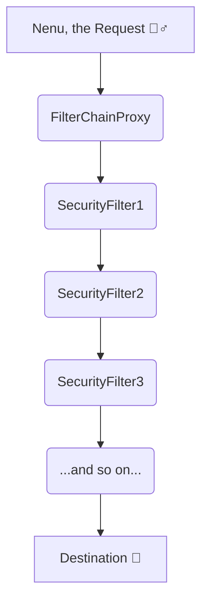

# Chapter 1: The Filter Chain Forest (Filter Chain Adavi 🌳)

Mana journey lo first stop, **The Filter Chain Forest**. Idi chala pedda adavi. Ee adavi lo chala "dwaralu" (gates) untayi. Pratidi oka "Security Filter". Manam ee adavi daati vellali ante, ee filters anni pass avvali.

Ee adavi ki main guard, **`FilterChainProxy`**. Veedu mana request ni chusi, ee adavi lo mana request ki saraina "trova" (path) எதுவோ చూపిస్తాడు.



## Asalu ee Filters em chestayi? (What do these filters do?)

Prati filter ki oka specific pani untundi. Konni examples:

-   `CsrfFilter`: Manam పంపిన request valid eh na, leka verey evaraina mana peru cheppi pampinara ani check chestundi.
-   `UsernamePasswordAuthenticationFilter`: Manam username and password pampiste, daani gurinchi pattinchukuntundi. (Deeni gurinchi next chapter lo detail ga chuddam).
-   `AuthorizationFilter`: Manaki oka particular page chuse "permission" unda leda ani check chestundi.

Spring Security lo by default ga chala filters untayi. Manam `SecurityFilterChain` bean create chesinappudu, ee filters anni oka chain la form avtayi.

Mana `SecurityConfig.java` lo ee code chudandi:

```java
@Bean
public SecurityFilterChain securityFilterChain(HttpSecurity http) throws Exception {
    http
        .authorizeHttpRequests(authorize -> authorize
            .requestMatchers("/", "/home").permitAll()
            .anyRequest().authenticated()
        )
        .formLogin(Customizer.withDefaults());

    return http.build();
}
```

Ikkada manam `http` object tho adukuntunnam ante, manam ee filter chain ni configure chestunnam anamata! For example, `.formLogin()` ani cheppagane, `UsernamePasswordAuthenticationFilter` active avtundi.

Ee adavi lo manam safe ga unnam ante, ee filters valle!

**Next Stop:** The first major gate, the `Authentication Filter`!

[<-- Back to Main Story](./SPRING_SECURITY_KATHA.md) | [Next Chapter -->](./2_AUTHENTICATION_FILTER_GATE.md)
