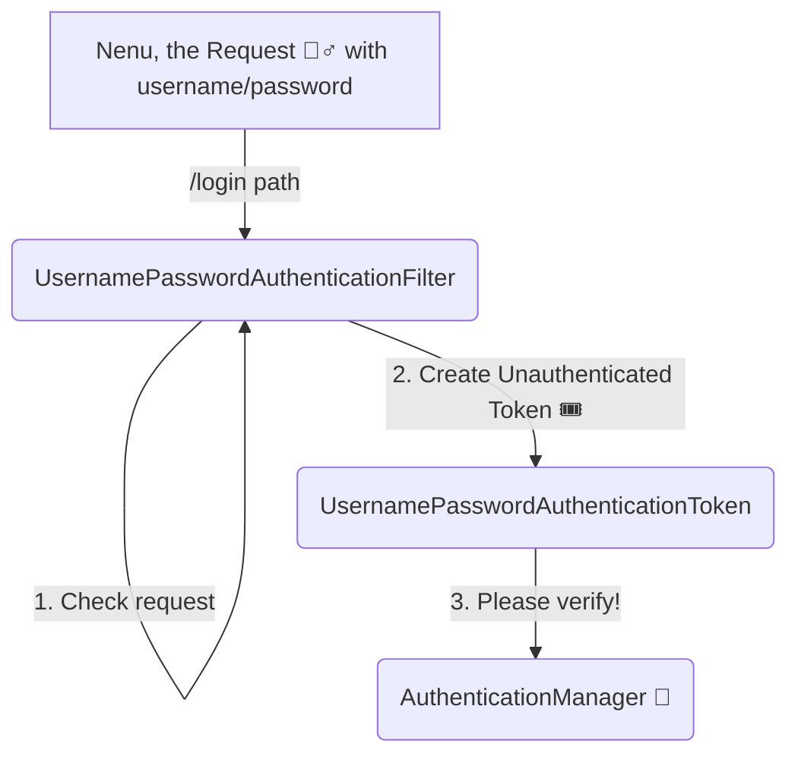

# Chapter 2: The Authentication Filter Gate (Authentication Filter Gate 🚪)

Adavi daatam, ippudu manam oka pedda "kota dwaram" (fort gate) mundu unnam. Ee gate peru **`UsernamePasswordAuthenticationFilter`**. Ee gate daggara unna guard manalni aapi, mana "identity" adugutadu.

Ee filter special ga `/login` path ki vache requests kosam wait chestu untundi. Manam form lo username and password pampinappudu, ee filter active avtundi.

## Em Jarugutundi Ikkada? (What happens here?)

1.  **Request Check:** Ee filter check chestundi, "Ee request `/login` ki vachinda? Mari POST method ah? Username and password unnaya?" ani.
2.  **Token Creation:** Avunu ani anipiste, mana username and password ni teeskuni, oka "identity chit" (identity slip) create chestundi. Deenine `UsernamePasswordAuthenticationToken` antaru. Ee token lo mana credentials untayi, kani deeniki inka "stamp" (authentication) padaledu. So, it's an **unauthenticated token**.
3.  **Forwarding:** Ee filter, ee "chit" ni teeskuni, valla "manager" ki pampistundi. Aa manager eh **`AuthenticationManager`**.

Mana `SecurityConfig.java` lo `formLogin(Customizer.withDefaults())` anagane, Spring ee `UsernamePasswordAuthenticationFilter` ni mana chain lo add chesestundi.

So, ippudu mana "identity chit" `AuthenticationManager` daggara undi. Akkada em jarugutundo next chapter lo chuddam.

**Next Stop:** The main fort, the `AuthenticationManager`!

[<-- Previous Chapter](./1_FILTER_CHAIN_ADAVI.md) | [<-- Back to Main Story](./SPRING_SECURITY_KATHA.md) | [Next Chapter -->](./3_AUTHENTICATION_MANAGER_DURGAM.md)
