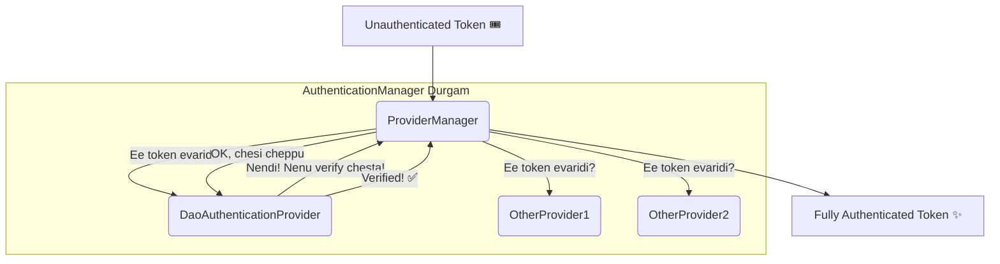

# Chapter 3: The Authentication Manager Fort (Authentication Manager Durgam 🏰)

Ippudu manam `AuthenticationManager` ane pedda "durgam" (fort) loki vacham. Idi oka Head Office anamata. Veedu pedda manager, so veedu prathi panini cheyadu. Veedu काम (work) ni vere vallaki delegate chestadu.

Ee `AuthenticationManager` ki default implementation peru **`ProviderManager`**.

### Interface vs. Class: A Clear Look

Let's get this clear mawa.

*   `AuthenticationManager`
    *   **Idi oka Interface.** Idi "authentication ela cheyyali?" ane contract (niyamam) ni define chestundi. Deentlo `authenticate()` ane method untundi.

*   `ProviderManager`
    *   **Idi oka Class.** Idi `AuthenticationManager` interface ki Spring Security lo **default implementation**. Manam special ga em cheyyakapothe, Spring ee class ni use cheskuntundi. Ee `ProviderManager` eh, chala `AuthenticationProvider`s ni manage chestundi.

Mana project lo, manam ekkada `ProviderManager` ni direct ga create cheyyaledu. Spring Boot auto-configuration eh daanini manakosam set chesestundi. Super kada!

## ProviderManager Pani Enti? (What does the ProviderManager do?)

1.  **Receive Token:** `UsernamePasswordAuthenticationFilter` pampina unauthenticated token 🎟️ ni `ProviderManager` receive cheskuntadu.
2.  **Delegate to Providers:** `ProviderManager` ki chala mandi "sainikulu" (soldiers) untaru. Ee sainikulune **`AuthenticationProvider`s** antaru. `ProviderManager` ee token ni teeskuni, tana daggara unna prathi provider ki pampi, "Ee token ni evaraina verify cheyagalara?" ani adugutadu.
3.  **Find the Right Provider:** Chala providers untaru (okati LDAP kosam, okati JWT kosam, etc.). Mana case lo, username/password authentication kosam unna provider peru **`DaoAuthenticationProvider`**. Ee provider "Nenu handle cheyagalanu!" ani munduku vastadu.
4.  **Get Final Report:** `DaoAuthenticationProvider` pani poorthi chesi, result ni `ProviderManager` ki istundi. Aa result "Authenticated" ✅ or "Failed" ❌ avvochu.
5.  **Return Authenticated Token:** Authentication successful aite, `ProviderManager` oka **fully authenticated token** create chesi, daani `UsernamePasswordAuthenticationFilter` ki tirigi pampistundi. Ee token lo mana roles/authorities anni untayi.

So, `AuthenticationManager` oka manager laaga act chestundi, kani asalu verification pani chesedi `DaoAuthenticationProvider`. Daani gurinchi next chapter lo telusukundam.

**Next Stop:** The magical world of `DaoAuthenticationProvider`!

[<-- Previous Chapter](./2_AUTHENTICATION_FILTER_GATE.md) | [<-- Back to Main Story](./SPRING_SECURITY_KATHA.md) | [Next Chapter -->](./4_PROVIDER_AND_DAO_MAAYALOKAM.md)
