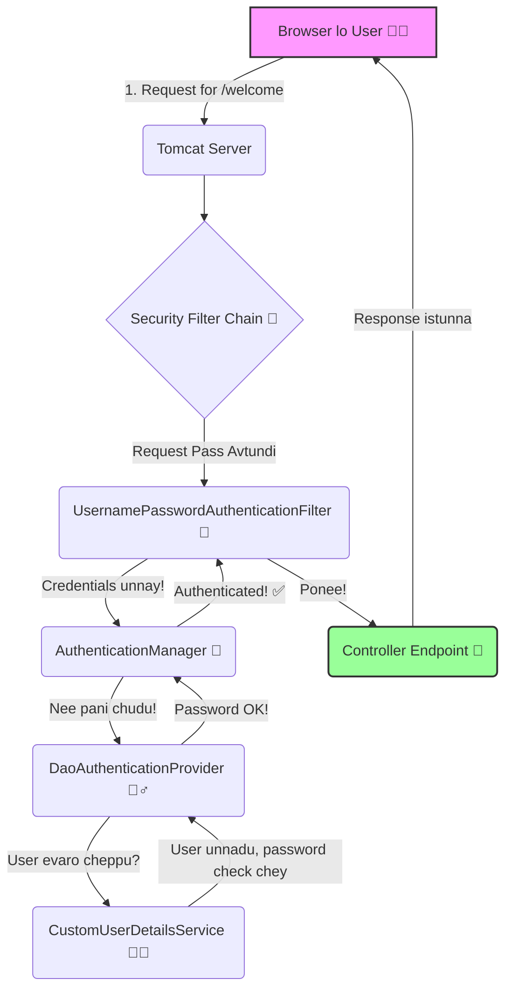

# Spring Security Katha 🚶‍♂️🔒

Namaste! Welcome to the story of Spring Security. Ee katha lo manam oka HTTP Request la udham. Mana peru **"Nenu, the Request"**. Manam browser nunchi bayalderi, server lo unna mana destination (oka Controller method) ki reach avvali.

But ee journey antha easy kaadu. Madhya lo chala "checkposts" ⚔️ untayi. Ee checkposts ye Spring Security anamata. Vaallu manalni aapi, "Evaru nuvvu? Enduku vachav?" ani adugutaru. Manam saraina credentials chupiste gani munduku vellaniyyaru.

Ee katha lo, manam ee checkposts anni ela daatukuntu veltamo chuddam. Ready ah? Let's begin the adventure!

## The Journey Map (Mana Prayanam)

Ikkada manam follow avaboye high-level path undi. Pratidi oka "chapter" anamata.



## Bonus Chapter: Switching Between Worlds (Default vs. Custom) 🎭

Ee project lo manam rendu rakala security configurations create chesam:

1.  **Default World**: Idi `DefaultSecurityConfig.java` lo undi. Deentlo `user` and `admin` ane ఇద్దరు users in-memory lo create chesam. Idi `@Profile("default")` tho mark cheyabadindi.
2.  **Custom World**: Idi `CustomSecurityConfig.java` lo undi. Idi mana `CustomUserDetailsService` ni use cheskuntundi, adi `customuser` ni load chestundi. Idi `@Profile("custom")` tho mark cheyabadindi.

By default, Spring Boot `default` profile ni activate chestundi. So, meeru application ni run cheste, `user/password` tho login avvochu.

**Custom World ni ela activate cheyali?**

`src/main/resources/` folder lo `application.properties` ane file create chesi, daantlo ee line add cheyandi:

```properties
spring.profiles.active=custom
```

Ila chesi application ni restart cheste, Spring Boot `default` profile ni ignore chesi, `custom` profile ni activate chestundi. Appudu meeru `customuser/custompass` tho login avvagalaru.

Marala default ki vellali ante, aa line ni comment cheyandi (`#spring.profiles.active=custom`) or `spring.profiles.active=default` ani marchandi.

Idhe Spring Profiles magic!

---

## The Chapters (Adhyayalu)

Ee journey lo prathi "checkpost" gurinchi detail ga telusukodaniki, kindha unna links click cheyandi.

1.  [**Chapter 1: The Filter Chain Forest (Filter Chain Adavi 🌳)**](./1_FILTER_CHAIN_ADAVI.md) - Asalu ee security antha ekkada start avtundi?
2.  [**Chapter 2: The Authentication Filter Gate (Authentication Filter Gate 🚪)**](./2_AUTHENTICATION_FILTER_GATE.md) - Manalni first aape checkpost.
3.  [**Chapter 3: The Authentication Manager Fort (Authentication Manager Durgam 🏰)**](./3_AUTHENTICATION_MANAGER_DURGAM.md) - The main boss who delegates the work.
4.  [**Chapter 4: The World of Providers & DAO Magic (Provider and DAO Maayalokam 🪄)**](./4_PROVIDER_AND_DAO_MAAYALOKAM.md) - The real detective who does the verification.
5.  [**Chapter 5: The UserDetails Secret (UserDetails Rahasyam 🤫)**](./5_USERDETAILS_RAHASYAM.md) - Mana gurinchi information ekkada store ayi untundi?
6.  [**Chapter 6: Our Custom World (Custom Lokam 🧑‍💻)**](./6_CUSTOM_LOKAM.md) - Manam create chesina custom classes gurinchi.

Mundu mundu ee chapters anni fill cheddam!
